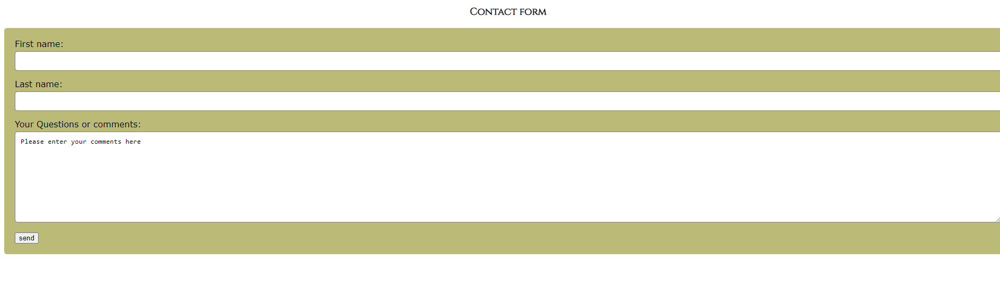

# New-To-Massage-Website
This website gives user basic informations about different types of massages. Each massage describes cons and pros of obtaining one. User can take a quiz to find out, if the specific massage is a good choice for him/her.

The website is built using **HTML5, CSS** and **JavaScript**.

## Layout of the website

### Hope page

### Before Appointment

### Benefits of Massage

### Contraindications

## Types of Massages

### Deep Tissue Massage

### Swedish Massage

### Lymphatic Massage

## Questionnaire

## Contact Form

 
 
